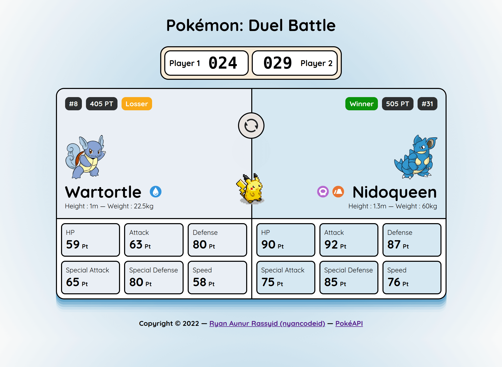

# Pokémon: Duel Battle
Sebuah Web Apps yang dibuat sebagai syarat kelulusan Dicoding Submission [Belajar Fundamental Front-End Web Development](https://www.dicoding.com/academies/163).

## Tech
Project ini menerapkan materi yang telah dipelajari pada Materi di kelas yang sudah saya sebutkan diatas. Yaitu Project ini sudah:

- Javascript ES6 & ES6 Module.
- Web Component (Custom Element) & Shadow DOM.
- Webpack untuk Development dan Production (Berbeda Config).
- ESLint dan Stylelint.
- Javascript Polyfill dengan Babel Loader dan Core-JS.
- Menggunakan format `WEBP` pada asset Gambar (lossless).
- Menggunakan SASS dan PostCSS.
- Menggunakan Event Emitter dengan bantuan library [mitt](https://github.com/developit/mitt).

## Screenshot


## How to Start
Untuk memulai development silahkan install dependency yang dibutuhkan dengan menggunakan Package Manager. Saya pribadi menggunakan PNPM, namun kalian bisa install menggunakan NPM atau Yarn walaupun tanpa `package-lock.json` atau `yarn-lock.json`.

```bash
# menggunakan PNPM
$ pnpm i
# menggunakan NPM
$ npm i
# menggunakan Yarn
$ yarn
```

### Start Development Server
Untuk menjalankan Webpack Dev Server dan memanfaatkan fitur Hot Reloadnya kita bisa menjalankan perintah.

```bash
$ npm run serve
```

### Production Build
Untuk build asset menjadi siap publish (production), kita bisa menjalankan perintah berikut. Hasil/ output nya akan berada pada folder `dist`.

```bash
$ npm run build
```

## PokéAPI
Project ini consume API yang provide oleh PokéAPI - https://pokeapi.co/docs/v2
